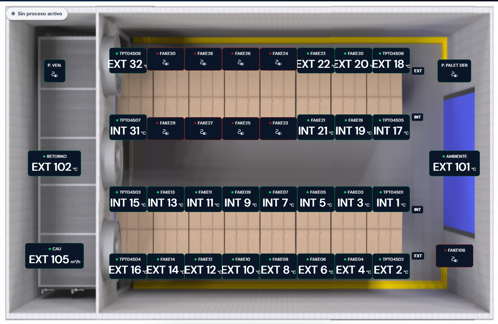
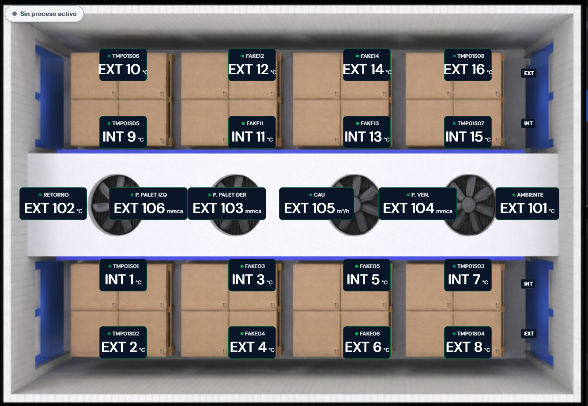

# Variantes de túnel

Cada ambiente tiene una `imageVariant` que va de la **A** a la **G**.

- **A–F** → túnel **californiano** (todas usan la misma configuración de grid y las mismas posiciones).
- **G** → túnel **doble con ventilador central** (configuración propia).

## Configuración de grid (`GRID_CONFIG` en `src/pages/Tuneles.tsx`)

| Variante | Columnas | Filas | Posiciones |
|----------|----------|-------|------------|
| A–F | `3.3fr repeat(8, 1fr) 2.7fr` | `repeat(7, 1fr)` | `DEFAULT_POSICIONES` |
| G | `1.2fr repeat(8, 1fr) 1.35fr` | `1fr 1fr 1fr 2.2fr 1fr 1fr 1fr` | `G_POSICIONES` |

Las posiciones están **hardcodeadas** en `src/pages/Tuneles.tsx`. Cada valor es un
área de grid en formato `"fila/columna"` (y en G se usa además `/ span 2`).
La clave del objeto es el número de `posicion` del sensor.

## `DEFAULT_POSICIONES` (variantes A–F)

```
 1: "5/9"    2: "6/9"    3: "5/8"    4: "6/8"
 5: "5/7"    6: "6/7"    7: "5/6"    8: "6/6"
 9: "5/5"   10: "6/5"   11: "5/4"   12: "6/4"
13: "5/3"   14: "6/3"   15: "5/2"   16: "6/2"
17: "3/9"   18: "2/9"   19: "3/8"   20: "2/8"
21: "3/7"   22: "2/7"   23: "3/6"   24: "2/6"
25: "3/5"   26: "2/5"   27: "3/4"   28: "2/4"
29: "3/3"   30: "2/3"   31: "3/2"   32: "2/2"

101: "4/10"  102: "4/1"  103: "2/10"
104: "2/1"   105: "6/1"  106: "6/10"
```

### Referencia de posiciones Túnel californiano (A-F)

| | | | | | | | | | |
|:--:|:--:|:--:|:--:|:--:|:--:|:--:|:--:|:--:|:--:|
| 104 | 32 | 30 | 28 | 26 | 24 | 22 | 20 | 18 | 106 |
| –  | 31 | 29 | 27 | 25 | 23 | 21 | 19 | 17 | –  |
| 102 | – | – | – | – | – | – | – | – | 101 |
| –  | 15 | 13 | 11 | 9 | 7 | 5 | 3 | 1 | –  |
| 105 | 16 | 14 | 12 | 10 | 8 | 6 | 4 | 2 | 106 |

Los valores visibles son `orientation` y `position`



## `G_POSICIONES` (variante G — túnel doble)

```
 1: "6/2 / span 2"    2: "5/2 / span 2"
 3: "6/4 / span 2"    4: "5/4 / span 2"
 5: "6/6 / span 2"    6: "5/6 / span 2"
 7: "6/8 / span 2"    8: "5/8 / span 2"
 9: "3/2 / span 2"   10: "2/2 / span 2"
11: "3/4 / span 2"   12: "2/4 / span 2"
13: "3/6 / span 2"   14: "2/6 / span 2"
15: "3/8 / span 2"   16: "2/8 / span 2"

101: "4/9 / span 2"  102: "4/1 / span 2"
103: "4/3 / span 2"  104: "4/7 / span 2"
105: "4/5 / span 2"
```
### Referencia de posiciones Túnel G


| | | | | | |
|:--:|:--:|:--:|:--:|:--:|:--:|
|   | 10 | 12 | 14 | 16 |   |
|   | 9  | 11 | 13 | 17 |   |
| **102** | **106** | **103** | **105** | **104** | **101** |
|   | 1  | 3  | 5  | 7  |   |
|   | 2  | 4  | 6  | 8  |   |

Los valores visibles son `orientation` y `position`

> La fila central en negrita (**101–106**) es la que va resaltada en amarillo — sensores especiales (`> 100`).



## Notas

- Posiciones `> 100` son sensores especiales (presión, flujo, etc.), centrados
  verticalmente (`alignSelf: 'center'`).
- La alineación vertical del resto depende de la paridad de la `posicion`
  (ver `getGridPos`): fila superior/inferior según sea par o impar.
